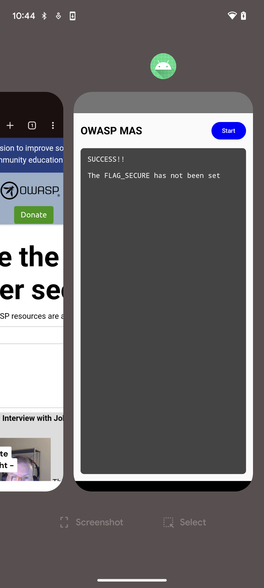
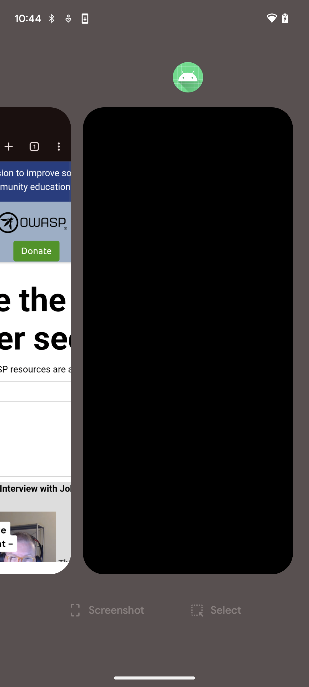

Ensure the app hides sensitive content, such as card numbers and passcodes, from screenshots, screen recording, nonsecure displays, task switcher thumbnails, and remote screen sharing. Malware may capture screen output and extract confidential information. Protect on screen keyboards or custom keypad views as they may leak keystrokes from passcode fields. Screenshots can be saved in locations accessible to other apps or a local attacker.

Setting [`FLAG_SECURE`](https://developer.android.com/security/fraud-prevention/activities#flag_secure) on the window prevents screenshots (or appear black), blocks screen recording, and hides content on nonsecure displays and in the system task switcher.

| Without `FLAG_SECURE` | With `FLAG_SECURE` |
|:----------------------:|:-----------------:|
|  |  |

You can follow the official documentation to implement `FLAG_SECURE` in your app, see ["Secure sensitive activities"](https://developer.android.com/security/fraud-prevention/activities).
